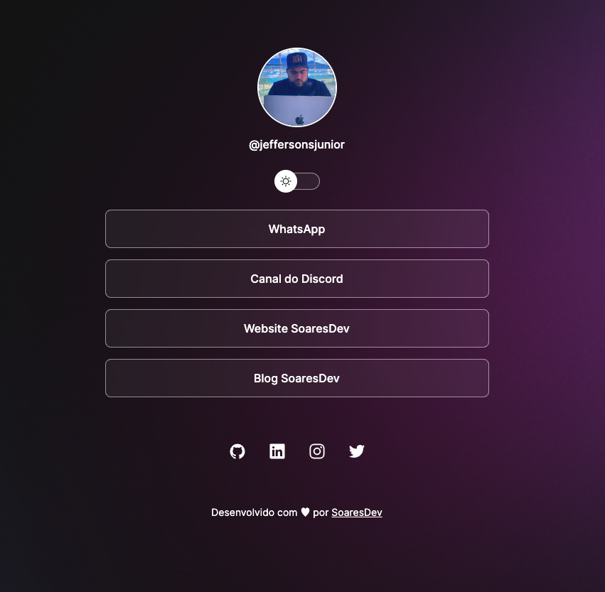
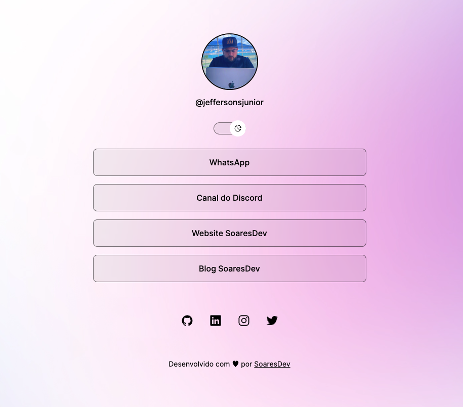

<div align="center" style="margin-bottom: 20px;">
  <h1>Links to social media</h1>
  <p align="center">
    
    
    
  </p>
</div>


### About project
This project is about quick links to social media, you can organize and insert links to redirect to other social media you use. To create this project I used HTML, CSS and JavaScript.


### Run this project
```bash
# clone this project
git clone https://github.com/jefferson1104/links-soaresdev.git

# to run this project execute index.html file
```

### Screenshots
<p align="center">
  
  
</p>
